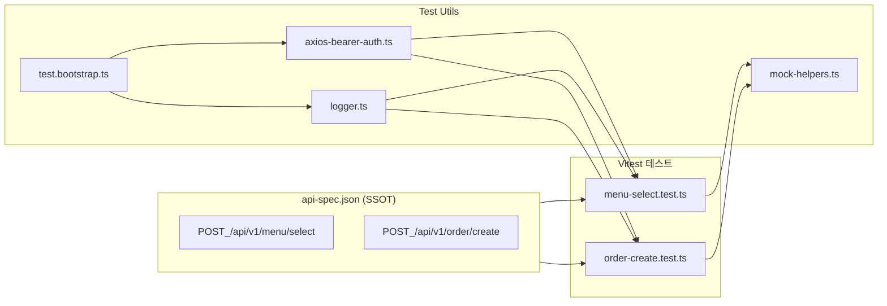

# Test Architecture Overview

## 1. 목적과 범위

이 프로젝트는 **REST API 동작을 자동 검증**하는 테스트 스위트입니다.
테스트는 다음 세 축을 중심으로 설계되었습니다.

- **사전 검증(클라이언트)**: 필수값 누락·타입/범위 위반은 **서버 호출 전 차단**
  → 네트워크 비용/노이즈 없이 입력 품질을 보장
- **성공 플로우**: 정상 동작 + **도메인 규칙**(예: 예약 만료 5분, `orderNo` 형식, 타임스탬프 허용 오차)
- **실패 플로우**: 인증/권한/존재/멱등 충돌/요청 한도/네트워크/타임아웃 등 **상태 코드별 에러 모델** 검증

**대표 플로우: 메뉴 선택 → 주문 생성**

- **Given**: 유효한 메뉴/회원 정보로 `/api/v1/menu/select` 호출
- **When**: 응답의 `reservationId`로 `/api/v1/order/create` 호출
- **Then**:

  - `orderNo`는 **8자리 영숫자**
  - `reservationId`는 **연결 유지**
  - 시간 규칙 충족: **예약 만료 5분**, 타임스탬프 **허용 오차(±1.5s)**

---

## 2. 레이어 구조와 책임

### Spec (SSOT)

- 파일: `src/data/api-spec.json`
- 역할:

  - **엔드포인트·메서드·URL·에러코드 매핑의 단일 출처**
  - 스키마는 명세 수준으로만 유지 (예제는 **테스트 본문에 명시적 리터럴**로 작성하여 실패지점 가시화)

- 지향점:

  - 테스트가 스펙을 **참조**는 하되, 스펙을 **오버라이드하지 않음**
  - 스펙과 테스트의 책임 분리(테스트 데이터는 테스트가 소유)

### Tests

- 파일: `src/tests/menu-select.test.ts`, `src/tests/order-create.test.ts`
- 섹션 순서(일관성 원칙):

  1. **검증(Pre)** – 클라이언트 입력 검증으로 **요청 자체를 차단**
  2. **성공(Success)** – 정상/멱등/플로우·비즈니스 규칙
  3. **실패(Failure)** – **상태 코드 오름차순(400→…→429→ERR)** 정렬

- 설계 특징:

  - **Given/When/Then** 주석 고정
  - **`expect.rejects`** 선호(실제 API 전환 시 수정 최소화)
  - **과도한 헬퍼 금지**: assertion은 **테스트 본문**에 남긴다
    (헬퍼는 **모킹 설정만** 담당)

### Utils

- 파일: `src/utils/mock-helpers.ts`, `src/utils/axios-bearer-auth.ts`, `src/utils/logger.ts`, `src/tests/test.bootstrap.ts`
- 역할:

  - **mock-helpers**: `mockSuccess` / `mockError` / `mockNetworkError`
    → 상태/헤더/에러코드/네트워크 단절을 **명시적으로 재현**
  - **axios-bearer-auth**: **ENV 게이트**로 Authorization 자동 주입 여부 제어
    (기본 **비활성**, 오케스트레이터 충돌 방지. **환경변수 오버라이드 금지** 원칙)
  - **logger**: 테스트 컨텍스트(스위트/케이스명) 기반 요청/응답 로깅. 자동 래핑도 **ENV 게이트**
  - **test.bootstrap**: 위 유틸 **단 1회 설치**. `vi.mock` 패치 중복 방지 가드 포함

---

## 3. 에러 모델 & 멱등성 모델

### 에러 모델(예시)

- **400 Bad Request**: 파싱 불가/스키마 위반/지원하지 않는 필드 등 **클라이언트 잘못**
- **401/403**: 인증/권한 에러
- **404**: 자원 미존재 (`MENU_NOT_FOUND`, `INVALID_RESERVATION`)
- **409 Conflict**: **도메인 충돌**

  - `INSUFFICIENT_INGREDIENTS`(재료 부족)
  - `IDEMP_CONFLICT`(같은 키 + **다른 바디**)
  - `DUPLICATE_ORDER`(동일 예약 ID로 중복 주문)

- **422 Unprocessable Entity**: `RESERVATION_EXPIRED`(업무 규칙상 처리 불가)
- **429 Too Many Requests**: `RATE_LIMIT_EXCEEDED`

  - `Retry-After`는 **초/HTTP-date 모두 허용** (테스트는 초 기반 예시 사용)

- **ERR 계열**: `ECONNABORTED`, `ENETUNREACH` 등 네트워크/타임아웃

### 멱등성 모델

- **Same Key + Same Body** ⇒ **200 + 동일 결과**(예: 동일 `reservationId` / `orderNo`)
- **Same Key + Different Body** ⇒ **409 `IDEMP_CONFLICT`**
  → **두 번째 요청은 처리되지 않아야 함**(로깅/카운트로 부수효과 없음도 관찰 가능한 수준으로 시뮬레이션)

---

## 4. 네이밍·구조 규칙

### 테스트 파일 섹션 구조

- `describe("검증")` → `describe("성공")` → `describe("실패")`

### 테스트 이름

- **프리픽스**: `MS`(Menu Select) / `OC`(Order Create) 등 엔드포인트 식별자 선택적 사용
- **형식 예시**

  - `MS | PRE | 필수값('menuId') 누락 — 요청 차단`
  - `MS | 200 | 메뉴 예약 성공 — 만료 5분`
  - `MS | 409 | IDEMP_CONFLICT — 동일 키 + 다른 바디`
  - `MS | 429 | 레이트리밋 — Retry-After(60s)`

---

## 5. 스키마 검증 정책

- **각 테스트 파일 상단**에 **로컬 스키마** 정의

  - 이유: **가독성/근접성**(테스트 본문에서 즉시 확인),
    실패 시 **어느 케이스가 어떤 필드로 깨졌는지** 바로 드러남

- 런타임 검증 항목 예시

  - `orderNo`: `/^[A-Z0-9]{8}$/`
  - `timestamp`/`createdAt`: `Date.parse` 가능한 ISO
  - 시간 규칙: `±1.5s`, 만료 `5분` 등 **도메인 규칙 수치화**

---

## 6. 모킹 전략

- `vi.mock("axios")` + `vi.mocked(axios, true)`
- **모킹 헬퍼는 설정만** 담당 (assertion은 **테스트 본문**)
- `mockSuccess(fn, data, stick?)`:

  - `stick=true`면 동일 응답 반복(멱등 시나리오)

- `mockError(fn, status, body, meta?)`:

  - `meta.headers`로 `Retry-After` 등 헤더 시뮬레이션

- `mockNetworkError(fn, code, message)`:

  - `ECONNABORTED`, `ENETUNREACH` 등 **AxiosError** 형태 재현

---

## 7. 환경 & 안전장치

- **환경변수 오버라이드 금지**: `.env`의 의미를 지키기 위해 **코드에서 덮어쓰지 않음**
- **ENV 게이트**: `AUTH_AUTOWRAP`, `LOG_AUTOWRAP`는 **기본 false**
  (필요 시 명시적으로 true 설정)
- **부트스트랩 단일화**: `test.bootstrap.ts`에서만 유틸 설치/패치 수행

---

## 8. 다이어그램 (흐름)

---

## 9. 새 엔드포인트 추가 체크리스트

1. **스펙 추가**: `api-spec.json`에 엔드포인트/에러코드 정의
2. **테스트 파일 생성**: `*.test.ts` with 섹션 `검증→성공→실패`
3. **모킹 케이스 준비**: `mockSuccess` / `mockError` / `mockNetworkError`
4. **로컬 Zod 스키마**: 성공 응답 스키마 최상단 정의
5. **네이밍 컨벤션**: 프리픽스/상태코드/도메인 태그 일관성 유지
6. **멱등성/에러 분기**: SameKey+SameBody / SameKey+DifferentBody 분리
7. **정렬**: 실패 케이스는 **상태 코드 오름차순**

---

## 10. 안티 패턴(지양)

- 테스트에서 **스펙을 덮어쓰는 임의 오버라이드**
- **과도한 헬퍼화**로 assertion이 테스트 밖으로 빠지는 것
- ENV를 코드에서 **임의 세팅/오버라이드**
- vi.mock("axios")는 본문에서 재모킹 금지

---
